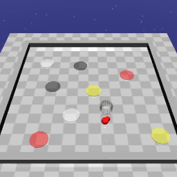
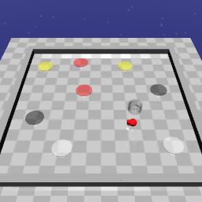

# Codes will be published after submission

# Demo

## ZoneEnv
We use a robot model form Safety Gym called Point. This agent observe the surrounding zones with lidar information. 
The agent is asked to visit/avoid zones according to STL task specifications. The inital positions of the zones and
the robot are generated randomly in each experiment.

## Examples
* Reach: $F_{[0, 3]}y$ (where $y$ for yellow) describing the task that reach yellow zone in next 3 time steps.
<figure>

 
</figure>

* Reach & Avoid: $F_{[0, 2]} w \wedge (!y U_{[0, 3]} b)$ (where $y$ for yellow, $w$ for white, $b$ for black)
describing the task that reach black zone but avoid yellow zone for next 3 steps, then reach white zone for next 
2 steps.
<figure>

 
</figure>

* Sequential Reach: $F_{[0, 3]}y \wedge F_{[0, 3]}b$  (where $y$ for yellow, $b$ for black) 
describing the task that reach yellow zone for the first 3 steps and reach the black zone 
for the next 3 steps.
<figure>

 
</figure>
